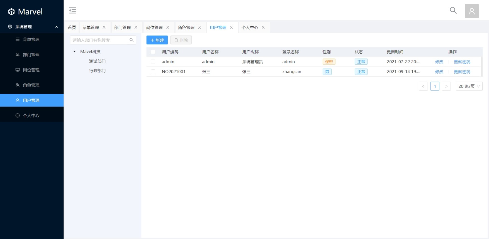

# 文档

## 介绍

 [](https://github.com/haoyuanqiang/marvel/blob/main/LICENSE)

基于 SpringBoot、JPA、React 的权限后台管理系统

> 一直想做一款后台管理系统，看了很多优秀的开源项目但是发现没有相似技术栈的。于是利用空闲休息时间开始自己写了一套后台系统。如此有了 Marvel。

**Marvel** 是一个基于微服务实现的后台管理系统，基于经典技术组合（Spring Boot、Spring Cloud、Spring Data JPA、Sa-Token、React、Umi）主要目的让开发者注重专注业务，降低技术难度，从而节省人力成本，缩短项目周期，提高软件安全质量。

**系统需求**

- JDK >= 1.8
- MySQL >= 5.7
- Maven >= 3.0


## 快速了解

### 主要特性

- 完全响应式布局（支持电脑、平板、手机等所有主流设备，目前暂时只支持电脑版）
- 支持多数据源，简单配置即可实现切换（计划未来支持）
- 新的权限体系，支持页面权限和接口权限，更大的权限控制自由度
- 前端采用 React + Umi + Ant Design  对常用 js 插件进行二次封装，使 js 代码变得简洁，更加易维护
- Maven 多项目依赖，模块分项目，尽量松耦合，方便模块升级、增减模块
- 国际化支持，服务端及客户端支持（计划未来实现）
- 支持服务监控，数据监控，缓存监控功能（计划未来实现）

### 技术选型

**1、系统环境**

- Java EE 8
- Servlet 3.0
- Apache Maven 3

**2、主框架**

- Spring Boot 2.3.1.RELEASE
- Spring Framework 5.2.x
- Sa-Token 1.12.1

**3、持久层**

- Spring Data JPA
- Hibernate Validation 6.0.x
- Alibaba Druid 1.2.x

**4、视图层**

- Umi 3.x
- Ant Design 4.x


## 环境部署

### 准备工作

```text
JDK >= 1.8 (推荐1.8版本)
Mysql >= 5.7.0 (推荐5.7版本)
Maven >= 3.0
```

### 运行系统运行系统

1、下载源码解压到工作目录
2、使用`IDEA`打开工程，菜单 `File` -> `Open...`，然后选择源码目录，即可成功打开。`IDEA`会自动加载`Maven`依赖包，初次加载会比较慢（根据自身网络情况而定）。
3、目前只支持 MySQL（其他数据库未经测试），手动创建数据库 marvel，并在 marvel-admin 中 application.yml 配置数据库连接
4、按照如下顺序运行项目：

后端：marvel-discovery   => marvel-admin => marvel-auth => marvel-gateway

前端：marvel-web (npm start 或者 yarn start)

5、打开浏览器，输入：([http://localhost:8000 (opens new window)](http://localhost/)) （默认账户/密码 `admin/admin`）
若能正确展示登录页面，并能成功登录，菜单及页面展示正常，则表明环境搭建成功

建议使用`Git`克隆，因为克隆的方式可以和`marvel`随时保持更新同步。使用`Git`命令克隆

```text
git clone https://github.com/haoyuanqiang/marvel.git
```


### 必要配置

- 修改数据库连接，编辑`marvel-admin/src/main/resources`目录下的`application.yml`

```yml
# 数据源配置
spring:
    datasource:
        url: jdbc:mysql://localhost:3306/marvel?useUnicode=true&characterEncoding=utf-8&useSSL=false&serverTimezone=GMT%2B8
    	username: root
    	password: Yanfa_1304
```


## 项目介绍

Marvel 一个基于 Spring Cloud 的基础微服务开发框架，有高效率，低封装的特点，非常适合学习和中小企业直接作为开发框架使用。

项目使用 Maven 进行管理，结构如下：

``` lua
marvel
├── marvel-admin     -- 管理模块（端口：8002）
├── marvel-auth      -- 授权中心（端口：8003）
├── marvel-discovery -- 服务注册发现中心（端口：8001）
├── marvel-gateway   -- ZUUL网关（端口：8080）
├── marvel-web       -- Web 前端
```


## 更新日志

暂无


## 贡献

欢迎志同道合的朋友贡献 PR。


## 截图





